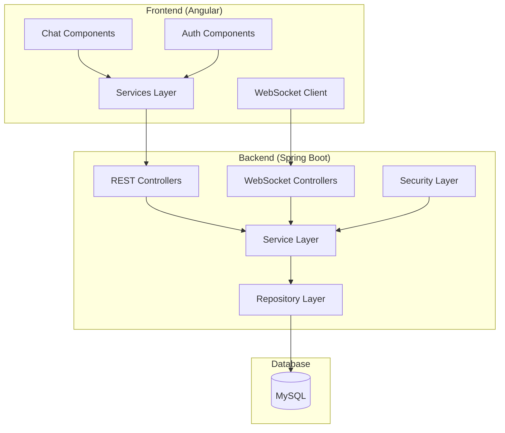

# Design Document - Real-Time Chat Application

## Overview

The real-time chat application is a full-stack web application built with Spring Boot backend, Angular frontend, and MySQL database. The system uses WebSocket technology (STOMP over SockJS) to enable instant messaging between users. The architecture follows a layered approach with clear separation of concerns between presentation, business logic, and data persistence layers.

## Architecture

### High-Level Architecture



### Technology Stack

**Backend:**
- Spring Boot 2.7+
- Spring WebSocket with STOMP
- Spring Data JPA with Hibernate
- Spring Security (optional for JWT)
- MySQL 8.0+
- Lombok for boilerplate reduction

**Frontend:**
- Angular 15+
- Bootstrap 5 for responsive UI
- SockJS client for WebSocket fallback
- STOMP.js for messaging protocol
- RxJS for reactive programming

## Components and Interfaces

### Backend Components

#### 1. Entity Models

**User Entity:**
```java
@Entity
@Table(name = "users")
public class User {
    @Id
    @GeneratedValue(strategy = GenerationType.IDENTITY)
    private Long id;
    
    @Column(unique = true, nullable = false)
    private String username;
    
    @Column(nullable = false)
    private String password;
    
    @Enumerated(EnumType.STRING)
    private UserStatus status; // ONLINE, OFFLINE
    
    @CreationTimestamp
    private LocalDateTime createdAt;
    
    @UpdateTimestamp
    private LocalDateTime lastSeen;
}
```

**Message Entity:**
```java
@Entity
@Table(name = "messages")
public class Message {
    @Id
    @GeneratedValue(strategy = GenerationType.IDENTITY)
    private Long id;
    
    @ManyToOne(fetch = FetchType.LAZY)
    @JoinColumn(name = "sender_id")
    private User sender;
    
    @ManyToOne(fetch = FetchType.LAZY)
    @JoinColumn(name = "receiver_id")
    private User receiver;
    
    @Column(columnDefinition = "TEXT")
    private String content;
    
    @Enumerated(EnumType.STRING)
    private MessageType type; // CHAT, JOIN, LEAVE
    
    @CreationTimestamp
    private LocalDateTime timestamp;
    
    private String groupId; // For group chats
}
```

#### 2. REST Controllers

**AuthController:**
- `POST /api/register` - User registration
- `POST /api/login` - User authentication
- `POST /api/logout` - User logout

**UserController:**
- `GET /api/users` - Get all users
- `GET /api/users/online` - Get online users
- `PUT /api/users/status` - Update user status

**MessageController:**
- `GET /api/messages/{userId}` - Get message history between users
- `GET /api/messages/group/{groupId}` - Get group message history

#### 3. WebSocket Configuration

**WebSocketConfig:**
```java
@Configuration
@EnableWebSocketMessageBroker
public class WebSocketConfig implements WebSocketMessageBrokerConfigurer {
    
    @Override
    public void configureMessageBroker(MessageBrokerRegistry config) {
        config.enableSimpleBroker("/topic", "/queue");
        config.setApplicationDestinationPrefixes("/app");
        config.setUserDestinationPrefix("/user");
    }
    
    @Override
    public void registerStompEndpoints(StompEndpointRegistry registry) {
        registry.addEndpoint("/ws/chat")
                .setAllowedOriginPatterns("*")
                .withSockJS();
    }
}
```

**ChatController (WebSocket):**
- `/app/chat.sendMessage` - Send private message
- `/app/chat.sendGroupMessage` - Send group message
- `/app/chat.addUser` - User joins chat
- `/app/chat.removeUser` - User leaves chat

#### 4. Service Layer

**UserService:**
- User registration and authentication
- User status management
- Online users tracking

**MessageService:**
- Message persistence
- Message history retrieval
- Message broadcasting logic

**ChatService:**
- WebSocket session management
- Real-time user tracking
- Message routing

### Frontend Components

#### 1. Angular Components

**LoginComponent:**
- User authentication form
- Form validation
- Navigation to registration

**RegisterComponent:**
- User registration form
- Username availability check
- Form validation

**ChatRoomComponent:**
- Main chat interface
- User list sidebar
- Message display area
- Message input form

**UserListComponent:**
- Display online/offline users
- User status indicators
- Click to start private chat

**MessageComponent:**
- Individual message display
- Timestamp formatting
- Sender/receiver styling

#### 2. Angular Services

**AuthService:**
```typescript
@Injectable()
export class AuthService {
  private apiUrl = 'http://localhost:8080/api';
  
  register(user: User): Observable<any>
  login(credentials: LoginRequest): Observable<any>
  logout(): void
  getCurrentUser(): User | null
  isAuthenticated(): boolean
}
```

**ChatService:**
```typescript
@Injectable()
export class ChatService {
  private stompClient: Client;
  private messageSubject = new Subject<Message>();
  private userStatusSubject = new Subject<UserStatus>();
  
  connect(): void
  disconnect(): void
  sendMessage(message: Message): void
  sendGroupMessage(message: Message, groupId: string): void
  subscribeToMessages(): Observable<Message>
  subscribeToUserStatus(): Observable<UserStatus>
}
```

## Data Models

### Database Schema

**Users Table:**
```sql
CREATE TABLE users (
    id BIGINT AUTO_INCREMENT PRIMARY KEY,
    username VARCHAR(50) UNIQUE NOT NULL,
    password VARCHAR(255) NOT NULL,
    status ENUM('ONLINE', 'OFFLINE') DEFAULT 'OFFLINE',
    created_at TIMESTAMP DEFAULT CURRENT_TIMESTAMP,
    last_seen TIMESTAMP DEFAULT CURRENT_TIMESTAMP ON UPDATE CURRENT_TIMESTAMP
);
```

**Messages Table:**
```sql
CREATE TABLE messages (
    id BIGINT AUTO_INCREMENT PRIMARY KEY,
    sender_id BIGINT NOT NULL,
    receiver_id BIGINT,
    content TEXT NOT NULL,
    type ENUM('CHAT', 'JOIN', 'LEAVE') DEFAULT 'CHAT',
    timestamp TIMESTAMP DEFAULT CURRENT_TIMESTAMP,
    group_id VARCHAR(100),
    FOREIGN KEY (sender_id) REFERENCES users(id),
    FOREIGN KEY (receiver_id) REFERENCES users(id),
    INDEX idx_sender_receiver (sender_id, receiver_id),
    INDEX idx_group_timestamp (group_id, timestamp),
    INDEX idx_timestamp (timestamp)
);
```

### Frontend Data Models

**TypeScript Interfaces:**
```typescript
export interface User {
  id: number;
  username: string;
  status: UserStatus;
  lastSeen?: Date;
}

export interface Message {
  id?: number;
  sender: User;
  receiver?: User;
  content: string;
  type: MessageType;
  timestamp: Date;
  groupId?: string;
}

export enum UserStatus {
  ONLINE = 'ONLINE',
  OFFLINE = 'OFFLINE'
}

export enum MessageType {
  CHAT = 'CHAT',
  JOIN = 'JOIN',
  LEAVE = 'LEAVE'
}
```

## Error Handling

### Backend Error Handling

**Global Exception Handler:**
```java
@ControllerAdvice
public class GlobalExceptionHandler {
    
    @ExceptionHandler(UserNotFoundException.class)
    public ResponseEntity<ErrorResponse> handleUserNotFound(UserNotFoundException ex)
    
    @ExceptionHandler(DuplicateUsernameException.class)
    public ResponseEntity<ErrorResponse> handleDuplicateUsername(DuplicateUsernameException ex)
    
    @ExceptionHandler(InvalidCredentialsException.class)
    public ResponseEntity<ErrorResponse> handleInvalidCredentials(InvalidCredentialsException ex)
    
    @ExceptionHandler(WebSocketException.class)
    public ResponseEntity<ErrorResponse> handleWebSocketError(WebSocketException ex)
}
```

**WebSocket Error Handling:**
- Connection failure fallback to SockJS
- Message delivery failure retry mechanism
- Session timeout handling
- Graceful disconnection handling

### Frontend Error Handling

**HTTP Error Interceptor:**
```typescript
@Injectable()
export class ErrorInterceptor implements HttpInterceptor {
  intercept(req: HttpRequest<any>, next: HttpHandler): Observable<HttpEvent<any>> {
    return next.handle(req).pipe(
      catchError((error: HttpErrorResponse) => {
        // Handle different error types
        // Show user-friendly error messages
        // Log errors for debugging
        return throwError(error);
      })
    );
  }
}
```

**WebSocket Error Handling:**
- Connection retry logic with exponential backoff
- Message queue for offline scenarios
- User notification for connection issues
- Automatic reconnection attempts

## Testing Strategy

### Backend Testing

**Unit Tests:**
- Service layer business logic testing
- Repository layer data access testing
- Controller layer endpoint testing
- WebSocket message handling testing

**Integration Tests:**
- Database integration testing
- WebSocket connection testing
- End-to-end message flow testing
- Authentication flow testing

**Test Configuration:**
```java
@TestConfiguration
public class TestConfig {
    @Bean
    @Primary
    public DataSource testDataSource() {
        return new EmbeddedDatabaseBuilder()
            .setType(EmbeddedDatabaseType.H2)
            .build();
    }
}
```

### Frontend Testing

**Unit Tests:**
- Component logic testing with Jasmine/Karma
- Service method testing
- Pipe and utility function testing
- Form validation testing

**Integration Tests:**
- Component interaction testing
- HTTP service integration testing
- WebSocket service testing
- Routing and navigation testing

**E2E Tests:**
- User registration and login flow
- Message sending and receiving
- Real-time updates verification
- Multi-user chat scenarios

### Performance Testing

**Load Testing:**
- Concurrent user connection testing
- Message throughput testing
- Database performance under load
- WebSocket connection limits

**Metrics to Monitor:**
- Message delivery latency (target: <1 second)
- Concurrent WebSocket connections (target: 1000+)
- Database query response time (target: <100ms)
- Memory usage and garbage collection

## Security Considerations

### Authentication & Authorization
- Password hashing using BCrypt
- Session management for WebSocket connections
- CORS configuration for cross-origin requests
- Input validation and sanitization

### WebSocket Security
- Origin validation for WebSocket connections
- Message content validation
- Rate limiting for message sending
- Session-based user identification

### Data Protection
- SQL injection prevention through JPA
- XSS protection in message content
- HTTPS enforcement in production
- Database connection encryption

## Deployment Architecture

### Development Environment
- Local MySQL database
- Spring Boot embedded server (port 8080)
- Angular development server (port 4200)
- Hot reload for both frontend and backend

### Production Environment
- MySQL database with connection pooling
- Spring Boot application as JAR deployment
- Angular build served by web server (Nginx)
- Load balancer for horizontal scaling
- WebSocket sticky sessions configuration